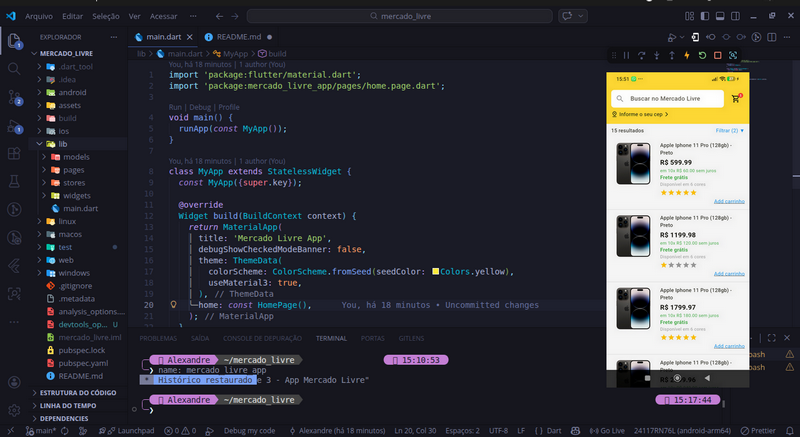

# 🛒 Mercado Livre Clone (Flutter)

Aplicativo mobile desenvolvido em Flutter inspirado no Mercado Livre, com foco em listagem de produtos e carrinho de compras reativo utilizando MobX.

## 📱 Funcionalidades

- 📦 Listagem de produtos
- 🛒 Adição de produtos ao carrinho
- 🔁 Atualização reativa da quantidade de itens no carrinho
- 🚫 Validação de produto já adicionado (com feedback via SnackBar)
- ⭐ Sistema de avaliação por estrelas (rating)
- 🔍 Campo de busca (UI)
- ⏳ Simulação de carregamento com CircularProgressIndicator
- 🧺 Tela de carrinho de compras

## ⚙️ Tecnologias utilizadas

- Flutter
- Dart
- MobX (gerenciamento de estado)

## 🧠 Regras de negócio implementadas

- O aplicativo exibe **15 produtos fixos**
- O preço dos produtos aumenta progressivamente conforme o índice
- Verificação de item duplicado no carrinho:
  - Produto já adicionado → SnackBar vermelho
  - Produto novo → SnackBar amarelo
- Atualização automática da quantidade de itens no carrinho (reatividade com MobX)

## 📸 Demonstração



## ▶️ Como executar o projeto

```bash
# Clone o repositório
git clone https://github.com/aleehblackstar/mercado_livre.git

# Acesse a pasta
cd mercado_livre

# Instale as dependências
flutter pub get

# Execute o projeto
flutter run